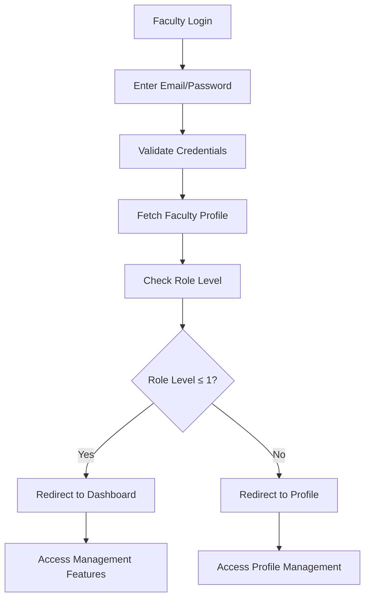

# Faculty Management System - Enhanced Guide

## Overview

The enhanced Faculty Management System provides a comprehensive solution for managing faculty members with automatic Firebase Authentication, role-based access control, and organized data structure. This system ensures secure access, proper data organization, and scalable faculty management.

## Key Features

### 🔐 Automatic Authentication
- **Firebase Auth Integration**: Automatically creates Firebase Auth accounts for faculty members
- **Secure Password Generation**: Generates secure passwords based on employee ID and name
- **Welcome Email System**: Sends password reset emails for initial login
- **Session Management**: Proper session handling with worker auth to avoid conflicts

### 🎯 Role-Based Access Control (RBAC)
- **Hierarchical Roles**: 5-tier role system (HOD → Professor → Associate Professor → Assistant Professor → Lecturer)
- **Permission-Based Access**: Granular permissions for different operations
- **Role Level Validation**: Automatic access control based on role levels

### 📊 Enhanced Data Structure
- **Unified Faculty Collection**: All faculty data stored in `/faculty/{uid}` structure
- **Metadata Tracking**: Comprehensive audit trail and versioning
- **Profile Completion Tracking**: Tracks profile completion status
- **Last Login Tracking**: Monitors faculty activity

## System Architecture

### Data Structure
```
/faculty/{authUid}
├── Personal Information
│   ├── name, dob, contactNo, emailID
│   ├── localAddress, permAddress
│   └── bankName, bankAccountNumber, ifsc
├── Professional Information
│   ├── empID, designation, department
│   ├── dateOfJoining, qualifications
│   └── areaOfSpecialization, experience
├── Authentication Data
│   ├── authUid, authEmail
│   ├── role, roleLevel, permissions
│   └── status, lastLogin
└── Metadata
    ├── createdAt, updatedAt
    ├── profileComplete, createdBy
    └── createdFrom, version
```

### Role Hierarchy
| Role | Level | Permissions |
|------|-------|-------------|
| HOD | 0 | Full department access, manage faculty, approve requests |
| Professor | 1 | Senior faculty access, manage courses, attendance |
| Associate Professor | 2 | Mid-level access, manage courses |
| Assistant Professor | 3 | Junior faculty access, edit grades |
| Lecturer | 4 | Basic access, view students and reports |

## Components

### 1. AddFaculty Component (`src/components/AddFaculty.jsx`)
**Purpose**: Add faculty members manually or via bulk upload

**Features**:
- Manual faculty entry with validation
- Excel bulk upload with progress tracking
- Automatic Firebase Auth creation
- Role-based data enhancement
- Welcome email sending

**Usage**:
```jsx
// Manual entry
<AddFaculty />

// Bulk upload
// Upload Excel file with faculty data
// System processes and creates accounts automatically
```

### 2. FacultyAuthHelpers (`src/utils/facultyAuthHelpers.js`)
**Purpose**: Utility functions for faculty authentication and management

**Key Functions**:
```javascript
// Create Firebase Auth account
const authResult = await createFacultyAuthAccount(facultyData);

// Get faculty profile
const profile = await getFacultyProfile(uid);

// Check permissions
const hasAccess = hasPermission(facultyPermissions, 'edit_grades');

// Faculty login
const loginResult = await facultyLogin(email, password);
```

### 3. FacultyProfile Component (`src/components/FacultyProfile.jsx`)
**Purpose**: Faculty self-service profile management

**Features**:
- View and edit personal information
- Role and permission display
- Profile completion tracking
- Secure update functionality

### 4. FacultyLogin Component (`src/components/FacultyLogin.jsx`)
**Purpose**: Faculty authentication portal

**Features**:
- Secure login with role validation
- Automatic redirection based on role level
- Session management
- Error handling

## Implementation Guide

### 1. Setting Up Faculty Management

#### Step 1: Configure Firebase
Ensure your Firebase configuration includes:
- Authentication enabled
- Firestore database
- Email templates for password reset

#### Step 2: Install Dependencies
```bash
npm install xlsx firebase
```

#### Step 3: Import Components
```jsx
import AddFaculty from './components/AddFaculty';
import FacultyProfile from './components/FacultyProfile';
import FacultyLogin from './components/FacultyLogin';
```

### 2. Adding Faculty Members

#### Manual Entry
1. Navigate to AddFaculty component
2. Select department
3. Fill in required fields (name, email, empID)
4. Submit - system automatically:
   - Creates Firebase Auth account
   - Generates secure password
   - Sends welcome email
   - Stores enhanced profile data

#### Bulk Upload
1. Prepare Excel file with faculty data
2. Upload file in AddFaculty component
3. System processes all entries with:
   - Progress tracking
   - Error handling
   - Batch processing
   - Auth account creation

### 3. Faculty Authentication Flow



### 4. Role-Based Access Implementation

#### Permission Checking
```javascript
import { hasPermission, hasRoleLevel } from '../utils/facultyAuthHelpers';

// Check specific permission
if (hasPermission(faculty.permissions, 'edit_grades')) {
  // Allow grade editing
}

// Check role level
if (hasRoleLevel(faculty.roleLevel, 2)) {
  // Allow course management
}
```

#### Component Protection
```jsx
const ProtectedComponent = ({ faculty, requiredPermission, children }) => {
  if (!hasPermission(faculty.permissions, requiredPermission)) {
    return <AccessDenied />;
  }
  return children;
};
```

## Data Validation

### Required Fields
- **name**: Faculty full name
- **emailID**: Valid email address
- **empID**: Employee identification number
- **department**: Department assignment

### Validation Rules
```javascript
const validation = validateFacultyData(facultyData);
if (!validation.isValid) {
  console.log('Validation errors:', validation.errors);
}
```

## Security Features

### 1. Authentication Security
- **Worker Auth**: Prevents session switching during account creation
- **Password Policy**: Secure password generation with timestamps
- **Email Verification**: Password reset emails for initial access

### 2. Data Security
- **UID-based Documents**: Firebase Auth UID as document ID
- **Permission Validation**: Server-side permission checking
- **Role-based Access**: Hierarchical access control

### 3. Profile Security
- **Read-only Fields**: Critical fields protected from faculty editing
- **Audit Trail**: Complete change tracking
- **Session Management**: Secure session handling

## Best Practices

### 1. Faculty Data Management
- Always validate data before creation
- Use bulk operations for large datasets
- Implement proper error handling
- Track all changes with metadata

### 2. Authentication
- Use worker auth for background operations
- Implement proper session management
- Send welcome emails for new accounts
- Handle authentication errors gracefully

### 3. Role Management
- Define clear permission hierarchies
- Implement role-based routing
- Validate permissions on both client and server
- Provide clear access feedback

### 4. Performance
- Use batch operations for bulk uploads
- Implement progress tracking
- Optimize database queries
- Cache frequently accessed data

## Troubleshooting

### Common Issues

#### 1. Authentication Errors
**Problem**: Faculty can't login after creation
**Solution**: 
- Check if welcome email was sent
- Verify Firebase Auth account exists
- Ensure email format is correct

#### 2. Permission Issues
**Problem**: Faculty can't access expected features
**Solution**:
- Verify role assignment
- Check permission arrays
- Validate role level hierarchy

#### 3. Bulk Upload Failures
**Problem**: Excel upload fails
**Solution**:
- Check Excel format and headers
- Verify required fields are present
- Review error logs for specific issues

#### 4. Profile Update Errors
**Problem**: Faculty can't update profile
**Solution**:
- Check field permissions
- Verify authentication status
- Review validation rules

### Debug Tools

#### 1. Console Logging
```javascript
// Enable detailed logging
console.log('Faculty data:', facultyData);
console.log('Auth result:', authResult);
console.log('Validation:', validation);
```

#### 2. Firebase Console
- Check Authentication users
- Review Firestore documents
- Monitor function logs

#### 3. Network Tab
- Monitor API calls
- Check response status
- Review error messages

## Future Enhancements

### Planned Features
1. **Faculty Dashboard**: Role-based dashboard with analytics
2. **Course Assignment**: Automatic course assignment based on specialization
3. **Attendance Management**: Faculty attendance tracking
4. **Performance Analytics**: Faculty performance metrics
5. **Mobile App**: Faculty mobile application
6. **API Integration**: External system integrations

### Scalability Considerations
1. **Database Optimization**: Index optimization for large datasets
2. **Caching Strategy**: Implement Redis caching
3. **Microservices**: Break down into microservices
4. **CDN Integration**: Static asset optimization
5. **Load Balancing**: Handle high traffic scenarios

## Support and Maintenance

### Regular Maintenance
1. **Database Cleanup**: Remove inactive faculty accounts
2. **Permission Review**: Regular permission audits
3. **Security Updates**: Keep Firebase SDK updated
4. **Performance Monitoring**: Monitor system performance
5. **Backup Strategy**: Regular data backups

### Support Channels
- **Technical Issues**: Check Firebase console logs
- **User Issues**: Review authentication logs
- **Data Issues**: Validate data integrity
- **Performance Issues**: Monitor database queries

---

This enhanced Faculty Management System provides a robust, scalable, and secure solution for managing faculty members in educational institutions. The system ensures proper authentication, role-based access control, and organized data management while maintaining high performance and security standards.
